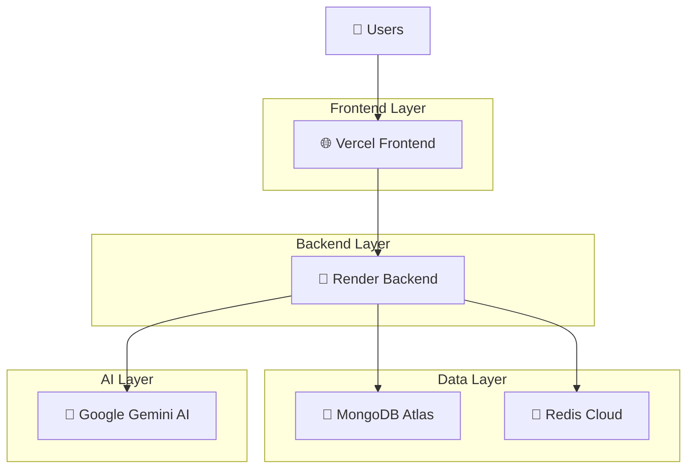

# 🤖 AI Component Generator Platform

> **A powerful full-stack platform for generating React components using AI with real-time preview, code editing, and seamless deployment.**

[](https://react-component-generator-sigma.vercel.app/)
[](https://ai-component-generator-backend-18mr.onrender.com/health)
[](https://github.com/Mohit-kumar123/REACT_COMPONENT_GENERATOR)

## 🎯 Overview

An intelligent, stateful AI-driven micro-frontend playground where authenticated users can iteratively generate, preview, tweak, and export React components. All chat history, code edits, and UI states are preserved across sessions with seamless auto-save functionality.

### ✨ Key Highlights

- 🤖 **AI-Powered Generation** using Google Gemini 2.0 Flash Lite
- 🔐 **Secure Authentication** with JWT and session persistence
- 💬 **Real-time Chat Interface** with complete conversation history
- 🎨 **Live Component Preview** with secure iframe sandboxing
- 📝 **Advanced Code Editor** with syntax highlighting and export
- 🔄 **Iterative Refinement** for component improvements
- 💾 **Auto-save & Resume** functionality across sessions
- 📱 **Responsive Design** optimized for all devices

## 🚀 Features

### 🔴 Core Features (Implemented)

| Feature | Description | Status |
|---------|-------------|--------|
| **Authentication & Persistence** | Secure signup/login with session management | ✅ Complete |
| **Conversational UI** | Side-panel chat with AI integration | ✅ Complete |
| **Live Component Preview** | Real-time rendering in secure sandbox | ✅ Complete |
| **Code Inspection & Export** | Syntax-highlighted JSX/CSS with download | ✅ Complete |
| **Iterative Refinement** | AI-powered component improvements | ✅ Complete |
| **State Management** | Auto-save with full session restoration | ✅ Complete |
| **Component Versioning** | Track and manage component versions | ✅ Complete |
| **Export Functionality** | Download components as ZIP files | ✅ Complete |

### 🟡 Advanced Features

- **Multi-session Management** - Create, load, and switch between projects
- **Component History** - Complete version control for generated components
- **Real-time Collaboration Ready** - Architecture supports future team features
- **Mobile-Responsive Interface** - Works seamlessly across all devices
- **Dark Theme UI** - Modern, professional interface design

## 🛠️ Tech Stack

### Frontend
- **⚛️ Next.js 14+** - React framework with SSR
- **🎨 Tailwind CSS** - Utility-first CSS framework
- **🔧 Shadcn/ui** - Modern React component library
- **📊 Zustand** - Lightweight state management
- **🖥️ Monaco Editor** - VS Code-powered code editor
- **🔒 Secure Sandboxing** - Iframe-based component preview
- **📱 Responsive Design** - Mobile-first approach

### Backend
- **🟢 Node.js 18+** - JavaScript runtime
- **⚡ Express.js** - Web application framework
- **🍃 MongoDB Atlas** - Cloud database service
- **🔴 Redis Cloud** - Caching and session management
- **🔐 JWT + bcrypt** - Authentication and security
- **🤖 Google Gemini API** - AI integration
- **🛡️ Security Middleware** - Rate limiting, CORS, validation

### Infrastructure
- **🌐 Vercel** - Frontend deployment and hosting
- **🔧 Render** - Backend API deployment
- **☁️ MongoDB Atlas** - Database hosting
- **⚡ Redis Cloud** - Cache hosting
- **📊 GitHub** - Version control and CI/CD

## 📁 Project Architecture

```
REACT_COMPONENT_GENERATOR/
├── 🎨 frontend/                    # Next.js + React Frontend
│   ├── src/
│   │   ├── app/                   # Next.js 14 App Router
│   │   │   ├── auth/              # Authentication pages
│   │   │   ├── dashboard/         # Main application
│   │   │   └── layout.tsx         # Root layout
│   │   ├── components/            # React Components
│   │   │   ├── auth/              # Login/Register forms
│   │   │   ├── layout/            # Header, Sidebar
│   │   │   ├── preview/           # Component preview
│   │   │   └── ui/                # Reusable UI components
│   │   ├── hooks/                 # Custom React hooks
│   │   ├── lib/                   # Utilities and helpers
│   │   ├── services/              # API integration
│   │   ├── store/                 # Zustand state management
│   │   └── types/                 # TypeScript definitions
│   ├── public/                    # Static assets
│   └── package.json              # Frontend dependencies
│
├── 🔧 backend/                     # Node.js + Express API
│   ├── src/
│   │   ├── models/               # MongoDB schemas
│   │   │   ├── User.js           # User model
│   │   │   └── Session.js        # Session model
│   │   ├── routes/               # API endpoints
│   │   │   ├── auth.js           # Authentication routes
│   │   │   ├── sessions.js       # Session management
│   │   │   ├── ai.js             # AI integration
│   │   │   └── components.js     # Component operations
│   │   ├── services/             # Business logic
│   │   │   └── aiService.js      # Google Gemini integration
│   │   ├── middleware/           # Custom middleware
│   │   │   ├── auth.js           # JWT verification
│   │   │   ├── errorHandler.js   # Error handling
│   │   │   └── requestLogger.js  # Request logging
│   │   ├── utils/                # Helper functions
│   │   └── server.js             # Express server
│   └── package.json              # Backend dependencies
│
├── 📚 docs/                       # Documentation
├── 🏗️ architecture-diagram.mmd    # System architecture
├── 📋 PROJECT_STATUS.md           # Development status
└── 📖 README.md                   # This file
```

## 🚀 Quick Start

### Prerequisites
- Node.js 18+ installed
- Git installed
- MongoDB Atlas account (or local MongoDB)
- Redis Cloud account (or local Redis)
- Google Gemini API key

### 🔧 Backend Setup

```bash
# Clone the repository
git clone https://github.com/Mohit-kumar123/REACT_COMPONENT_GENERATOR.git
cd REACT_COMPONENT_GENERATOR/backend

# Install dependencies
npm install

# Configure environment variables
cp .env.example .env
# Edit .env with your credentials

# Start development server
npm run dev
```

### 🎨 Frontend Setup

```bash
# Navigate to frontend directory
cd ../frontend

# Install dependencies
npm install

# Configure environment variables
cp .env.example .env.local
# Edit .env.local with your backend URL

# Start development server
npm run dev
```

### 🌐 Access the Application

- **Frontend:** http://localhost:3000
- **Backend API:** http://localhost:5000
- **Health Check:** http://localhost:5000/health

## 📖 API Documentation

### Authentication Endpoints
```
POST /api/auth/register    # User registration
POST /api/auth/login       # User login
GET  /api/auth/me          # Get user profile
PUT  /api/auth/profile     # Update profile
```

### Session Management
```
GET    /api/sessions       # List user sessions
POST   /api/sessions       # Create new session
GET    /api/sessions/:id   # Get specific session
PUT    /api/sessions/:id   # Update session
DELETE /api/sessions/:id   # Delete session
```

### AI Operations
```
POST /api/ai/generate      # Generate new component
POST /api/ai/refine        # Refine existing component
POST /api/ai/chat          # General chat
GET  /api/ai/models        # Available AI models
```

### Component Management
```
GET  /api/components/:sessionId/versions    # List component versions
GET  /api/components/:sessionId/:version    # Get specific version
GET  /api/components/:sessionId/current     # Get current version
POST /api/components/:sessionId/duplicate   # Duplicate component
GET  /api/components/:sessionId/:version/download  # Download ZIP
```

## 🌐 Live Deployment

### 🔗 Production URLs

- **🎨 Frontend Application:** https://react-component-generator-sigma.vercel.app/
- **🔧 Backend API:** https://ai-component-generator-backend-18mr.onrender.com/
- **📊 API Health Check:** https://ai-component-generator-backend-18mr.onrender.com/health

### 🚀 Deployment Architecture



## 🎯 Usage Guide

### 1. **Getting Started**
   - Sign up for a new account or login
   - Create a new session to start generating components

### 2. **Generating Components**
   - Use the chat interface to describe your component
   - Example: "Create a modern button with hover effects"
   - Watch as AI generates JSX and CSS code in real-time

### 3. **Refining Components**
   - Continue the conversation to refine your component
   - Example: "Make the button larger and change color to blue"
   - See instant updates in the live preview

### 4. **Managing Code**
   - View generated JSX and CSS in syntax-highlighted tabs
   - Copy code to clipboard or download as ZIP
   - All changes are automatically saved

### 5. **Session Management**
   - Switch between different projects using the sidebar
   - All chat history and components are preserved
   - Resume work exactly where you left off

## 🔒 Security Features

- **🔐 JWT Authentication** - Secure token-based authentication
- **🛡️ Password Hashing** - bcrypt encryption for user passwords
- **🚫 Rate Limiting** - Prevents API abuse and spam
- **✅ Input Validation** - Server-side validation for all inputs
- **🔒 CORS Protection** - Controlled cross-origin access
- **🏢 Secure Sandboxing** - Iframe isolation for component preview
- **🔑 Environment Variables** - Sensitive data protection

## 📊 Performance Optimizations

- **⚡ Caching** - Redis for session and API response caching
- **🗜️ Code Splitting** - Next.js automatic code splitting
- **📱 Responsive Design** - Optimized for all screen sizes
- **🚀 CDN Delivery** - Vercel's global CDN for fast loading
- **💾 Auto-save** - Debounced saves to prevent excessive API calls
- **🔄 Hot Reload** - Instant component preview updates

## 🧪 Testing & Quality

- **✅ Type Safety** - Full TypeScript implementation
- **🔍 Error Handling** - Comprehensive error boundaries
- **📝 Input Validation** - Client and server-side validation
- **🛡️ Security Testing** - JWT and authentication testing
- **📊 Performance Monitoring** - API response time tracking

## 🤝 Contributing

We welcome contributions! Please follow these steps:

1. **Fork the repository**
2. **Create a feature branch** (`git checkout -b feature/amazing-feature`)
3. **Commit your changes** (`git commit -m 'Add amazing feature'`)
4. **Push to the branch** (`git push origin feature/amazing-feature`)
5. **Open a Pull Request**

### 📋 Development Guidelines

- Follow TypeScript best practices
- Use Tailwind CSS for styling
- Maintain component isolation
- Write descriptive commit messages
- Test your changes thoroughly

## 📄 License

This project is licensed under the **MIT License** - see the [LICENSE](LICENSE) file for details.

## 👨‍💻 Author

**Mohit Kumar**
- GitHub: [@Mohit-kumar123](https://github.com/Mohit-kumar123)
- Project Repository: [REACT_COMPONENT_GENERATOR](https://github.com/Mohit-kumar123/REACT_COMPONENT_GENERATOR)

## 🙏 Acknowledgments

- **Google Gemini AI** for powerful component generation
- **Vercel** for seamless frontend deployment
- **Render** for reliable backend hosting
- **MongoDB Atlas** for cloud database services
- **Redis Cloud** for caching solutions
- **Tailwind CSS** for beautiful styling
- **Next.js** for the amazing React framework

## 📈 Project Status

🎉 **Status: Production Ready & Live**

This project is actively maintained and deployed in production. Feel free to explore the live demo, contribute to the codebase, or use it as a reference for your own AI-powered applications!

---

<div align="center">

**⭐ If you found this project helpful, please give it a star! ⭐**

[](https://github.com/Mohit-kumar123/REACT_COMPONENT_GENERATOR/stargazers)

</div>
